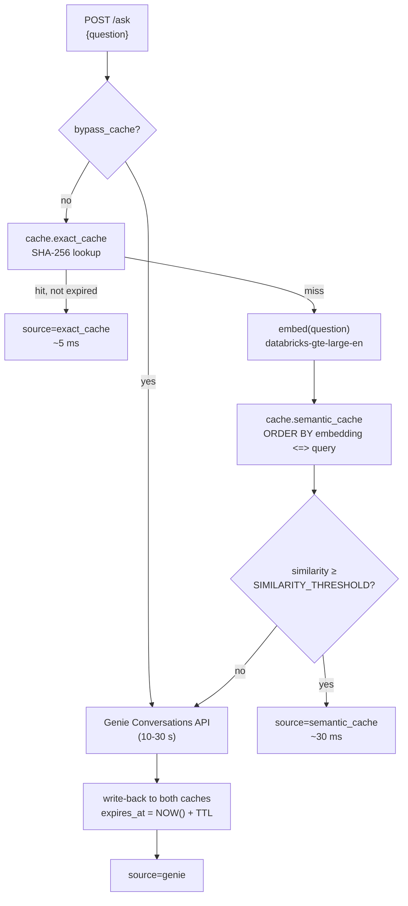

# genie-cache

Plug-and-play semantic caching proxy for Databricks Genie spaces.

Genie answers are slow (often 10–30 s) because every `/ask` call reruns the NL-to-SQL pipeline. This plugin deploys a FastAPI proxy as a Databricks App that sits in front of any Genie space and serves answers from a Lakebase Postgres cache whenever the incoming question matches a prior one — exactly or semantically.

- **Exact cache** — SHA-256 hash lookup, sub-5 ms.
- **Semantic cache** — pg_vector HNSW cosine search against `databricks-gte-large-en` embeddings, ~30 ms.
- **Miss** — falls through to the Genie Conversations API, then writes both cache layers for next time.
- **TTL + background cleanup** — every cached row carries `expires_at`; a periodic task deletes expired rows.
- **Result-row inlining with a cap** — stores up to `CACHE_MAX_RESULT_ROWS` rows per response so fast-path answers include data, not just SQL.
- **Chat UI + /stats + /admin/cleanup** — everything ships in the same app.

## Architecture

```
Client ── /ask ──▶ FastAPI proxy (Databricks App)
                   ├── exact_cache  (SHA-256 → JSONB)
                   ├── semantic_cache (VECTOR(1024) HNSW)
                   └── Genie Conversations API (fallback)
                         │
                         └─ Lakebase Postgres (cache.*)
```

The proxy checks the exact cache first, then the semantic cache (cosine similarity ≥ `SIMILARITY_THRESHOLD`), and only calls Genie on a miss. Misses are written to both caches with an `expires_at` = now + `CACHE_TTL_SECONDS`. A background task runs every `CACHE_CLEANUP_INTERVAL_SECONDS` and deletes expired rows.

### Decision flow



The three return paths map one-to-one to the `source` field in the `/ask` response — every answer is self-describing about which layer served it. See [`docs/architecture.md`](docs/architecture.md) for the full picture (sequence diagrams, schema, deployment topology, design decisions).

## Prerequisites

- **Databricks workspace** that supports Apps + Lakebase (FE-VM serverless, or any workspace with Lakebase enabled).
- **Genie space** already built against your data. You'll need its space ID.
- **Local tooling**:
  - `databricks` CLI 0.229.0+ (`brew upgrade databricks`).
  - `yq` (`brew install yq`).
  - `psql` from `postgresql@16` (`brew install postgresql@16`).
- **Authenticated CLI profile** for the target workspace:
  ```
  databricks auth login --host https://<workspace> --profile <profile>
  ```

## Install

```bash
export PROFILE=my-workspace
export GENIE_SPACE_ID=01f11821c34b1783b8c13e2a0c1b752a
export LAKEBASE_INSTANCE_NAME=genie-cache-db
export DATABASE_NAME=genie_cache_db
export APP_NAME=genie-cache-proxy
export WORKSPACE_USER_EMAIL=me@example.com
export CREATE_INSTANCE=true      # or false to reuse an existing Lakebase instance
export LAKEBASE_CAPACITY=CU_1    # only used when creating

bash skills/genie-cache-install/resources/install.sh
```

The installer:

1. Checks prerequisites + profile validity.
2. Creates (or reuses) the Lakebase instance and waits for it to become `AVAILABLE`.
3. Creates the target database if it doesn't exist.
4. Creates the Databricks App (empty shell) and reads back its service-principal ID.
5. Provisions the `cache.*` schema and grants the app SP the minimum privileges.
6. Renders `app.yaml` from the template, syncs the app code into the workspace.
7. Deploys the app.

At the end you'll see the app URL and a reminder to attach three resources in the app UI (the Lakebase instance, the embedding endpoint, and the Genie space). Redeploy once to pick up the auto-injected env vars — that's it.

## Configure

All knobs live in `app.yaml` (rendered from `app.yaml.template`) and are read at startup. Change them, redeploy.

| Env var | Default | Meaning |
|---|---|---|
| `GENIE_SPACE_ID` | (required) | Space to proxy. |
| `EMBEDDING_ENDPOINT` | `databricks-gte-large-en` | Foundation Model serving endpoint, 1024-dim. |
| `SIMILARITY_THRESHOLD` | `0.80` | Minimum cosine similarity for a semantic-cache hit. |
| `CACHE_TTL_SECONDS` | `86400` | Row TTL (0 = never expire). |
| `CACHE_CLEANUP_INTERVAL_SECONDS` | `3600` | Background cleanup cadence (0 = disabled). |
| `CACHE_MAX_RESULT_ROWS` | `100` | Max result rows inlined per cached response. |

## Verify

```bash
PROFILE=my-workspace APP_NAME=genie-cache-proxy \
  bash skills/genie-cache-install/resources/verify.sh
```

Hits `/health`, `/stats`, and `POST /ask` twice against the deployed app. The second `/ask` should report `source: exact_cache` with a latency under a few hundred ms.

## Layout

```
genie-cache-plugin/
├── .claude-plugin/plugin.json       Plugin manifest
├── README.md                        This file — overview + decision flow + API ref
├── docs/
│   ├── architecture.md              Full system + decision + sequence diagrams
│   └── setup.md                     Install steps for both paths + troubleshooting
├── notebooks/                       Embedded path — caching inside a notebook, no app
│   ├── README.md
│   └── genie_cache_embedded.py      Databricks source notebook
└── skills/
    ├── genie-cache-install/         Installer — scaffolds Lakebase + app
    │   ├── SKILL.md
    │   └── resources/
    │       ├── install.sh           Orchestrator
    │       ├── verify.sh            Smoke test
    │       ├── bootstrap.sql        Idempotent schema + grants
    │       └── app_template/        FastAPI app source (synced to workspace)
    ├── genie-cache-stats/           /stats inspector
    │   └── SKILL.md
    └── genie-cache-tune/            SIMILARITY_THRESHOLD tuner
        └── SKILL.md
```

## Two deployment paths

- **App-based (`skills/genie-cache-install/`)** — deploys a FastAPI proxy as a Databricks App. Multiple callers share the cache via HTTP. Use when cache state should outlive any one notebook/job.
- **Embedded (`notebooks/`)** — drops caching helpers directly into a notebook and rewrites `query_genie()` in place. No app, no service principal dance. Use when you just want to cache calls from your own client code.

Both paths target the same Lakebase schema, so you can switch between them without re-provisioning the database.

## API reference

The app exposes five HTTP endpoints. Everything is JSON in / JSON out.

### `POST /ask`

Primary entry point. Runs the decision flow above.

**Request**

```json
{
  "question": "What were our top 5 regions by revenue last quarter?",
  "space_id": "01f11821c34b1783b8c13e2a0c1b752a",
  "bypass_cache": false
}
```

| Field | Type | Required | Notes |
|---|---|---|---|
| `question` | string | yes | 1–2000 chars. |
| `space_id` | string | no | Overrides `GENIE_SPACE_ID` from env. |
| `bypass_cache` | bool | no | Skip both caches; always call Genie. Still write-back on return. |

**Response**

```json
{
  "question": "What were our top 5 regions by revenue last quarter?",
  "source": "semantic_cache",
  "response": {
    "sql": "SELECT region, SUM(revenue) ...",
    "rows": [["NA", 1234567.0], ["EMEA", 987654.0]],
    "columns": ["region", "revenue"],
    "conversation_id": "..."
  },
  "latency_ms": 32,
  "matched_question": "Top regions by revenue Q4",
  "similarity": 0.87
}
```

| Field | Type | When populated |
|---|---|---|
| `source` | `"exact_cache"` \| `"semantic_cache"` \| `"genie"` | Always. |
| `matched_question` | string | Semantic hits only. |
| `similarity` | float | Semantic hits only (0–1 cosine similarity). |
| `latency_ms` | int | Always. |

### `GET /health`

```json
{"status": "ok", "space_id": "01f11821c34b1783b8c13e2a0c1b752a"}
```

### `GET /stats`

```json
{
  "exact":    {"total_rows": 1240, "expired_rows": 12, "total_hits": 8430},
  "semantic": {"total_rows": 1240, "expired_rows": 12, "total_hits": 2150},
  "ttl_seconds": 86400,
  "max_result_rows": 100
}
```

### `POST /admin/cleanup`

Manually triggers the TTL sweep. Returns deletion counts.

```json
{"exact_deleted": 12, "semantic_deleted": 12}
```

### `GET /api/info`

Self-describing manifest of all endpoints — handy when pointing a new tool at the proxy.

## Key design decisions

1. **Two caches, not one.** Exact match is sub-5 ms and handles "same user reruns the same question" for free. Semantic catches rephrasings at ~30 ms. Cheap path wins when it can.
2. **Write-through, not write-behind.** Genie calls are 10-30 s; the extra write latency is rounding error, and we never risk silent cache rot.
3. **`expires_at` column, not native TTL.** Portable, cheap, lets `NULL` mean "never expire" without schema changes.
4. **HNSW over IVFFlat.** No training corpus, no `lists` tuning — good recall out of the box under 1M rows.
5. **`max_lifetime=2700` on the pool.** Lakebase OAuth tokens expire at 1 h; default `3600` creates a race. Recycling at 45 min leaves 15 min of headroom.
6. **`SIMILARITY_THRESHOLD` default 0.80.** Break-even between hit rate and false positives on Genie rephrasing patterns. The `genie-cache-tune` skill helps tune it per workload.

Full rationale and more decisions in [`docs/architecture.md`](docs/architecture.md#key-design-decisions).

## Known limitations

- **Single Genie space per app.** `GENIE_SPACE_ID` is startup-resolved; multi-tenant routing means running multiple app instances.
- **Multi-turn conversations bypass the cache.** Follow-ups like "now break it down by region" depend on parent context and aren't cached.
- **No user-scoped cache.** All callers share the same keys — row-level security must live upstream in Genie / the SQL warehouse, not here.
- **Result-row cap.** `CACHE_MAX_RESULT_ROWS` (default 100) caps inlined rows per cached response. Larger result sets cache the SQL only.
- **`VECTOR(1024)` is fixed.** Switching embedding models means dropping `cache.semantic_cache`.

## License

MIT (see `LICENSE`).
