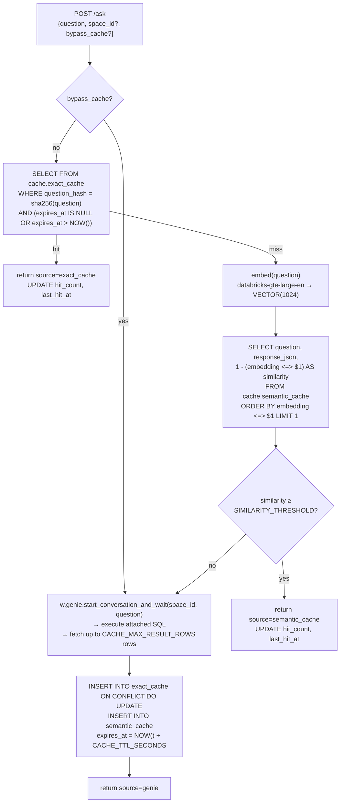
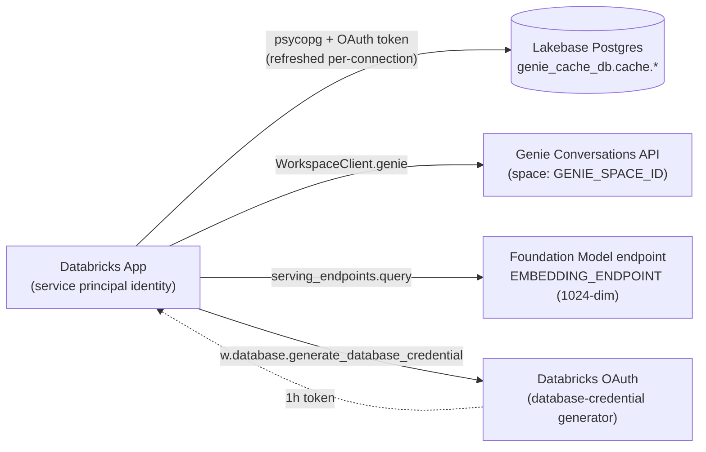
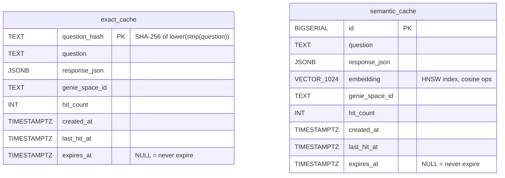
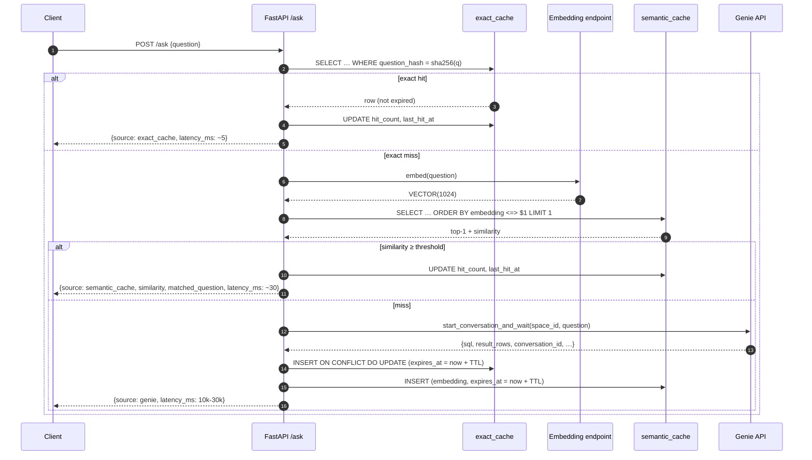
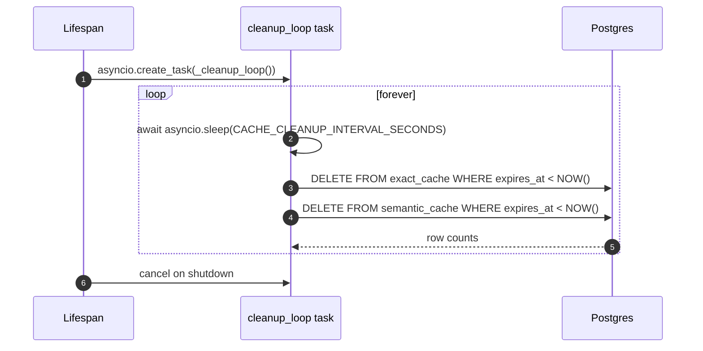
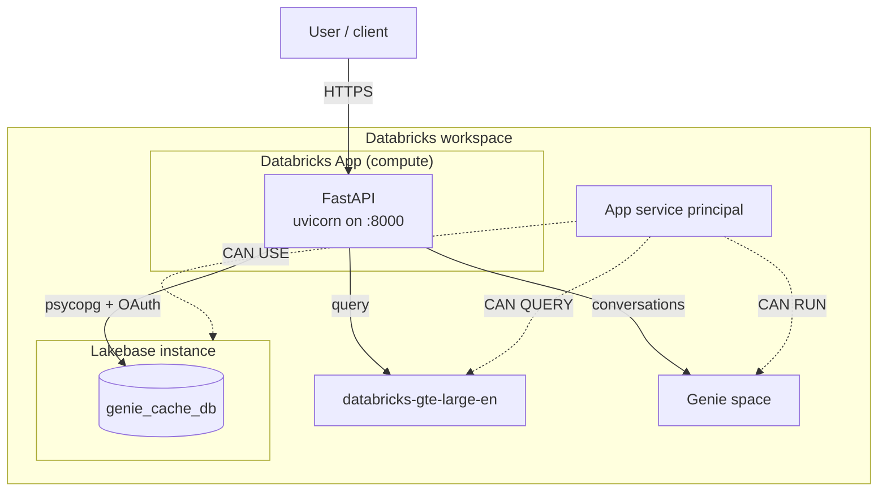
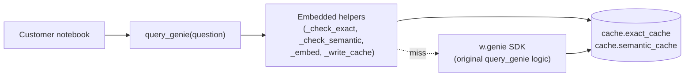

# Architecture

This document describes the internal design of `genie-cache` — the FastAPI proxy, the Lakebase schema, the request flow, and the rationale behind the key design choices. If you just want to run it, read the root [`README.md`](../README.md) and [`docs/setup.md`](setup.md) instead.

## System diagram

```mermaid
flowchart TB
    subgraph Client["Client"]
        UI["Chat UI (static/index.html)"]
        API["Any HTTP client / SDK"]
    end

    subgraph App["Databricks App — FastAPI proxy"]
        ASK["POST /ask"]
        STATS["GET /stats"]
        CLEAN["POST /admin/cleanup"]
        LIFE["Lifespan<br/>(pool.open + bootstrap + cleanup task)"]
    end

    subgraph Cache["Lakebase Postgres — cache schema"]
        EXACT[("exact_cache<br/>question_hash PK")]
        SEM[("semantic_cache<br/>VECTOR(1024) HNSW")]
    end

    subgraph Databricks["Databricks platform"]
        EMB["Foundation Model:<br/>databricks-gte-large-en"]
        GENIE["Genie Conversations API"]
    end

    UI --> ASK
    API --> ASK
    ASK -->|1. SHA-256 lookup| EXACT
    ASK -->|2. embed| EMB
    ASK -->|3. cosine search| SEM
    ASK -->|4. fallback| GENIE
    ASK -->|5. write-back| EXACT
    ASK -->|5. write-back| SEM
    LIFE -.->|periodic DELETE WHERE expires_at < NOW()| EXACT
    LIFE -.->|periodic DELETE WHERE expires_at < NOW()| SEM
    STATS --> EXACT
    STATS --> SEM
    CLEAN --> EXACT
    CLEAN --> SEM
```

## Decision flow

The single most important picture in this repo — the exact path a question takes through the proxy.



The three return paths map one-to-one to the `source` field in the response, so every `/ask` call is self-describing: you always know which layer served the answer and how long it took.

## External dependencies



Three Databricks-hosted dependencies and no third-party services. All identities flow through the app's service principal — the installer grants it `CAN USE` on the Lakebase instance, `CAN QUERY` on the embedding endpoint, and `CAN RUN` on the Genie space.

## Schema



Both tables share the same lifecycle: a miss writes to both, a hit updates one, the cleanup task deletes from both. They are **not** foreign-keyed — the overlap is semantic, not referential. This keeps a semantic eviction from accidentally invalidating an exact-cache entry and vice versa.

### Indexes

| Table | Index | Purpose |
|---|---|---|
| `exact_cache` | `question_hash` (PK) | Sub-ms point lookup on every `/ask`. |
| `exact_cache` | `expires_at WHERE expires_at IS NOT NULL` | Cheap TTL sweep — index only the rows that can expire. |
| `semantic_cache` | `embedding` HNSW, `vector_cosine_ops` | Approximate-nearest-neighbor cosine search (~30 ms at 100k rows). |
| `semantic_cache` | `expires_at WHERE expires_at IS NOT NULL` | Same TTL-sweep pattern. |

## Request flow



## Cleanup task

On startup, `lifespan()` spawns an asyncio task that wakes every `CACHE_CLEANUP_INTERVAL_SECONDS` and deletes expired rows from both tables. Disabled when either knob is `0`.



The same deletion logic is exposed as `POST /admin/cleanup` for on-demand runs and for the `genie-cache-stats` skill.

## Deployment topology



All four Databricks resources (app, instance, embedding endpoint, Genie space) must live in the same workspace — cross-workspace tokens are not in scope.

## Standalone alternative — embedded notebook

The [`notebooks/`](../notebooks/) path bypasses the app entirely: the caching helpers are dropped straight into a Databricks notebook that already calls `query_genie()`. Same schema, same decision flow, different delivery.



### What's reused vs. replaced

| Concern | App path | Embedded path |
|---|---|---|
| Decision flow (exact → semantic → Genie) | identical | identical |
| Schema (`cache.exact_cache`, `cache.semantic_cache`) | identical | identical |
| Cache TTL + `expires_at` | identical | identical |
| Embedding endpoint | identical | identical |
| Pool with `max_lifetime=2700` + `OAuthConnection` | in `server/db.py` | in the notebook |
| Instance + database bootstrap | `install.sh` step [2/7]+[3/7] | notebook cell 3 |
| Cross-caller sharing | any HTTP client | only the notebook/job that runs it |
| Auth identity | app service principal | notebook user |
| `/stats`, `/admin/cleanup`, chat UI | yes | no (use SQL directly) |

The two paths target the **same Lakebase schema**, so a customer can start embedded, graduate to the app later, and the historical cache carries over.

## Key design decisions

1. **Two caches, not one.** Exact match on SHA-256 is sub-5 ms and handles the common "same user reruns the same question" pattern for free. Semantic search costs an embedding round-trip (~20 ms) plus an HNSW probe (~10 ms), but catches rephrasings. Running both means the cheap path wins when it can, and the expensive path only kicks in when it has to.
2. **Write-through, not write-behind.** On a Genie miss we insert into both caches before returning. The alternative (fire-and-forget async write) gets you ~50 ms back but risks silent cache rot if the writer task dies. Given Genie calls are 10-30 s, the extra write latency is rounding error.
3. **`expires_at` column, not `CREATE TABLE … WITH (ttl=…)`.** Postgres has no native TTL. A nullable `expires_at` column + partial index + periodic `DELETE WHERE expires_at < NOW()` is portable, cheap to reason about, and lets us set `expires_at = NULL` for "never expire" without schema changes.
4. **HNSW, not IVFFlat.** HNSW builds lazily, doesn't require a training corpus, and gives good recall at our scale (<1M rows). IVFFlat needs `lists` tuned for the data volume — not a knob we want customers touching.
5. **`VECTOR(1024)` hardcoded.** Matches `databricks-gte-large-en`. Switching embedding models means dropping the table, which is deliberate — mixing dimensions silently corrupts cosine distance.
6. **`max_lifetime=2700` on the pool.** Lakebase OAuth tokens expire after 1 hour. `psycopg_pool`'s default `max_lifetime=3600` creates a race where a connection is handed out seconds before its token expires. Recycling at 45 minutes leaves 15 minutes of headroom.
7. **Sync route handlers, not async.** psycopg's sync API runs cleanly in FastAPI's threadpool and matches the official Databricks tutorial. Going async would force a second pool type (`psycopg_pool.AsyncConnectionPool`) with no latency win for this workload.
8. **`SIMILARITY_THRESHOLD` as a knob, default 0.80.** Lower = more hits but more false positives ("show me sales" matching "show me orders"). Higher = fewer hits but safer. 0.80 is the break-even we've seen empirically on Genie rephrasing patterns. The `genie-cache-tune` skill walks users through finding their own.

## Known limitations

- **Single-space per app.** `GENIE_SPACE_ID` is resolved at startup from env. Pointing one proxy at multiple Genie spaces means running multiple app instances. `space_id` on the `/ask` body is pass-through for experimentation, not multi-tenancy.
- **Multi-turn conversations bypass the cache.** Caching a follow-up like "now break it down by region" is meaningless without the parent context. The proxy (and the embedded `query_genie`) only caches first-turn questions — follow-ups go straight to Genie.
- **No user-scoped cache.** Every caller shares the same cache keys. This is fine for public Genie spaces but wrong for row-level-secured data — a user who can't see the rows can still see a cached answer derived from them. Row-level security belongs upstream in the Genie space / SQL warehouse, not in this cache.
- **Result-row cap.** `CACHE_MAX_RESULT_ROWS` caps how many result rows we inline per response. Queries returning more get their SQL cached but not their full result — the client has to re-run the SQL to paginate. Default is 100.
- **`VECTOR(1024)` is fixed.** See design decision #5.

## References

- Lakebase: <https://docs.databricks.com/aws/en/lakebase/>
- Genie Conversations API: <https://docs.databricks.com/aws/en/genie/conversations-api>
- pgvector HNSW: <https://github.com/pgvector/pgvector#hnsw>
- psycopg_pool: <https://www.psycopg.org/psycopg3/docs/advanced/pool.html>
